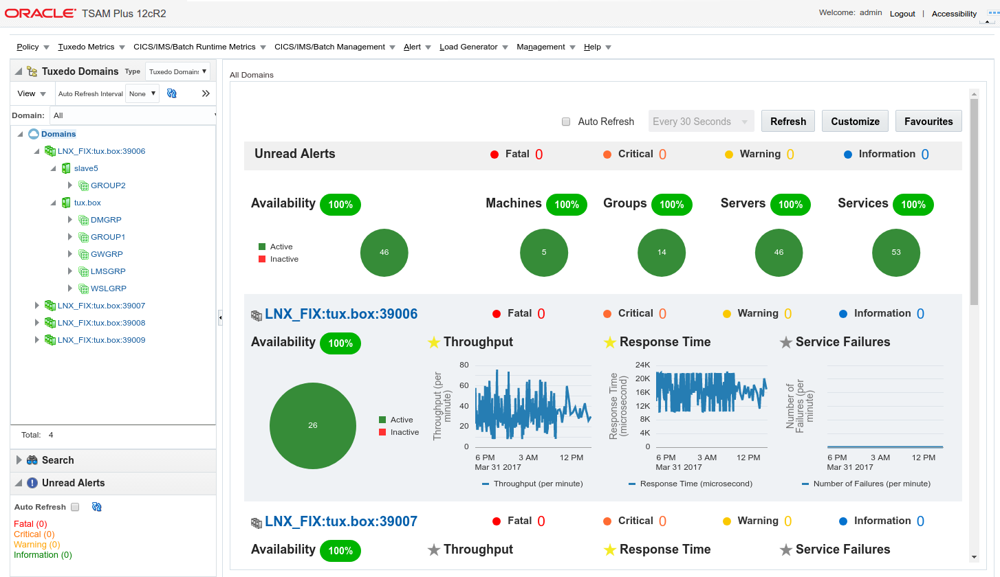

Oracle TSAM Plus 12.2.2.1 Showcase
===============
This sample is for demonstrating the brand new TSAM Dashboard introduced in release 12.2.2.1 (12.2.2 GA + RP003 or above).

In TSAM 12.2.2.1, the Dashboard was completely re-designed and re-implemented powered by the [Oracle JET](http://www.oracle.com/webfolder/technetwork/jet/index.html) technology. The new dashboard is highly customizable to fit all kinds of users' needs and preferences. A new type of agent aggregated service statistics metrics was introduced, which allows completely out of the box monitoring from the dashboard and getting alerts by the pre-defined alert rules.

Besides the new Dashboard, there are also some other exciting new features introduced in the 12.2.2.1 release. Please check [Announcing TSAM Plus 12.2.2.1.0](https://blogs.oracle.com/Tuxedo/entry/announcing_tsam_plus_12_2) for more detail.

## Dependencies
This sample is based on below Docker images which should be built previous to build this image.

* `oracle/database:11.2.0.2-xe`, see [OracleDatabase](../../../OracleDatabase) for detail.
* `oracle/tuxedo:12.2.2`, see [OracleTuxedo](../../../OracleTuxedo) for detail.
* `oracle/tsam:12.2.2.1`, see the [apply-patch](../apply-patch) sample for detail.

Besides, the new features depend on Tuxedo latest rolling patch and TSAM Agent latest rolling patch to be patched into the `TUXDIR`. On first running of the provided `docker-compose.yml` file, a new Docker image `oracle/tuxedo:12.2.2-4doms` will be built based on the `oracle/tuxedo:12.2.2` image and **rolling patch packages located in the [dockerfiles](dockerfiles) directory**.

Currently, the latest rolling patches are:

* [Tuxedo 12.2.2 RP016](https://updates.oracle.com/Orion/Services/download/p25391869_122200_Linux-x86-64.zip?aru=21005987&patch_file=p25391869_122200_Linux-x86-64.zip) - `p25391869_122200_Linux-x86-64.zip`
* [TSAM 12.2.2 RP004](https://updates.oracle.com/Orion/Services/download/p25530287_12220_Linux-x86-64.zip?aru=21140450&patch_file=p25530287_12220_Linux-x86-64.zip) - `p25530287_12220_Linux-x86-64.zip`

## Running the Sample
After all above dependencies are resolved, run below command against the `docker-compose.yml` file provided in current directory to startup the containers:
 
```bash
docker-compose up
```

It will take a while to build the new image, create new database, TSAM database schema and WebLogic domain, etc. If everything goes well, you'll see console output similar to below lines at the end:
 
```
...
...
tsam_1    | Your environment has been set.
tsam_1    | weblogic.Deployer invoked with options:  -user weblogic -deploy tsam_wls12c.ear -adminurl t3://localhost:7001
tsam_1    | <Apr 1, 2017 6:52:16 AM UTC> <Info> <J2EE Deployment SPI> <BEA-260121> <Initiating deploy operation for application, tsam_wls12c [archive: /u01/oracle/oraHome/tsam12.2.2.0.0/deploy/tsam_wls12c.ear], to configured targets.>
tsam_1    | Task 0 initiated: [Deployer:149026]deploy application tsam_wls12c on AdminServer.
tsam_1    | Task 0 completed: [Deployer:149026]deploy application tsam_wls12c on AdminServer.
tsam_1    | Target state: deploy completed on Server AdminServer
tsam_1    |
tsam_1    | Done.
```

Then find out the mapped port of `7001` inside the container on your host machine, for example:

```bash
$ docker-compose port tsam 7001
0.0.0.0:32790
```

By accessing the URL `http://<hostname>:32790/tsam` in your browser, and login with the user name `admin` and password `admin1`, you'll be able to see dashboard page looks like below:



## Copyright
Copyright (c) 1996-2017 Oracle and/or its affiliates. All rights reserved.
